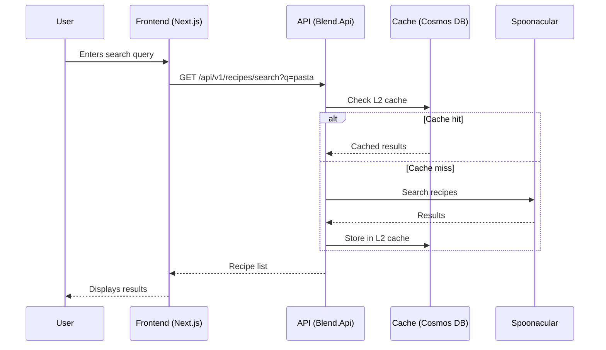
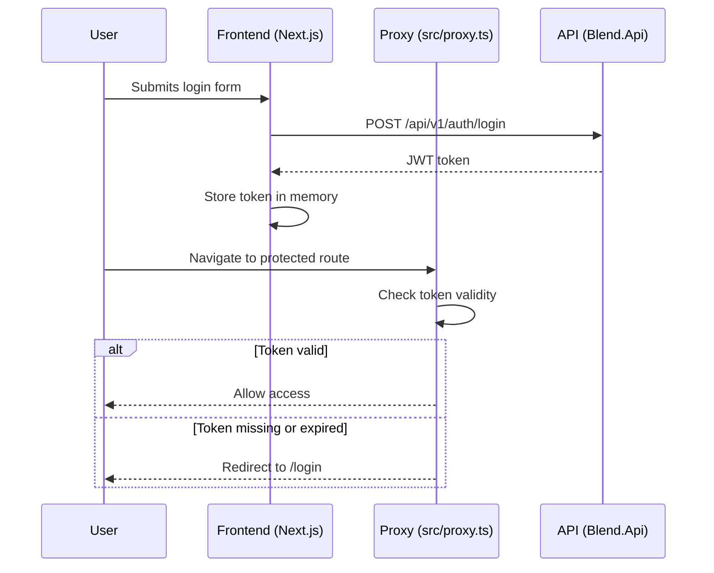
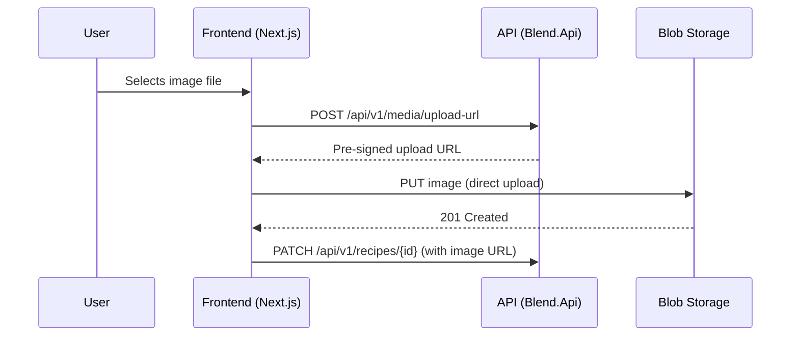
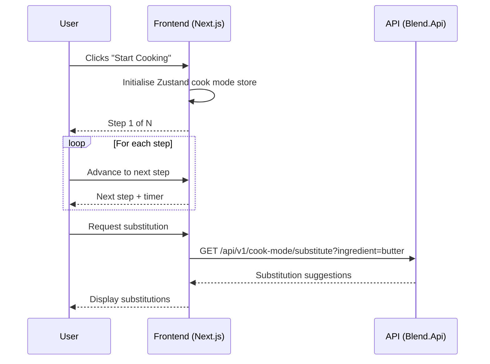

# Data Flow

This page describes how data flows through the Blend application for key user journeys.

## Recipe Discovery Flow

## Authentication Flow

## Image Upload Flow

## Cook Mode Session Flow

## TODO

- Add data flow diagram for the social feed (follow graph, activity aggregation)
- Add data flow diagram for personalised recommendations

See [System Design](system-design.md) for the domain model and component architecture.
